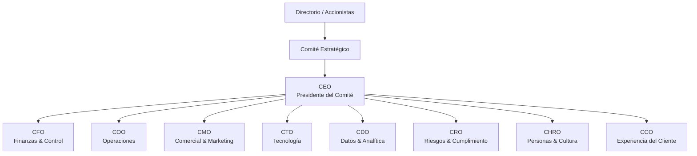
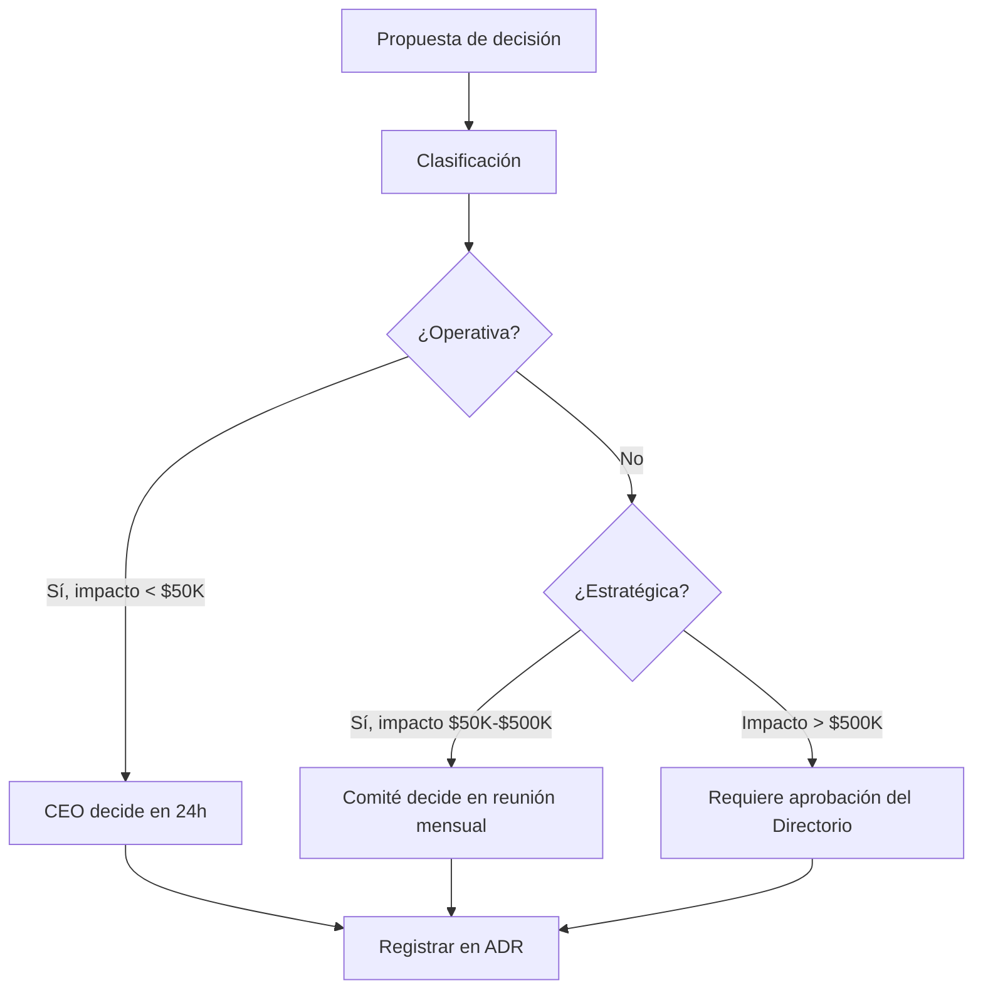

# Comité Estratégico — Definición y Funcionamiento

**Versión:** 1.0  
**Fecha:** 2026-06-02  
**Actualización:** Trimestral

---

## 1. Propósito

El Comité Estratégico es el órgano máximo de dirección ejecutiva responsable de definir, supervisar y ajustar la estrategia corporativa, garantizando la alineación entre objetivos, recursos y resultados.

---

## 2. Composición

---

## 3. Funciones del Comité

### 3.1 Funciones Estratégicas

- Definir y revisar la estrategia corporativa.
- Aprobar el Plan Anual y presupuesto.
- Supervisar el cumplimiento de OKRs corporativos.
- Tomar decisiones de inversión estratégica.
- Evaluar fusiones, adquisiciones y alianzas.

### 3.2 Funciones de Supervisión

- Revisar el Balanced Scorecard trimestral.
- Supervisar los KPIs críticos del negocio.
- Analizar la matriz de riesgos y acciones de mitigación.
- Aprobar los Architecture Decision Records (ADRs) de alto impacto.

### 3.3 Funciones de Gobierno

- Aprobar políticas corporativas.
- Supervisar el cumplimiento normativo y regulatorio.
- Revisar los informes de auditoría interna y externa.
- Aprobar cambios en la estructura organizacional.

---

## 4. Responsabilidades por Rol

| Miembro | Responsabilidad principal | KPIs bajo supervisión |
|---|---|---|
| **CEO** | Estrategia integral, cultura, resultados globales | Ingresos, EBITDA, NPS, Employee Engagement |
| **CFO** | Salud financiera, control de costos, inversiones | EBITDA, ROI, CAC, LTV, Flujo de caja |
| **COO** | Eficiencia operativa, SLAs, productividad | SLA cumplimiento, % incidentes, productividad |
| **CMO** | Crecimiento comercial, marca, adquisición | Leads, Conversión, CAC, Revenue, NPS |
| **CTO** | Disponibilidad sistemas, deuda técnica, innovación | Uptime, MTTR, velocidad de despliegue |
| **CDO** | Calidad de datos, analítica, AI roadmap | Completitud datos, precisión ML, uso BI |
| **CRO** | Gestión de riesgos, cumplimiento, controles | Riesgos abiertos, KRI, auditorías cerradas |
| **CHRO** | Talento, retención, cultura, capacitación | Rotación, engagement, performance |
| **CCO** | Satisfacción cliente, retención, experiencia | NPS, CSAT, Churn, Tiempo de resolución |

---

## 5. Frecuencia y Agenda de Reuniones

### Reunión Semanal (Operativa — 60 min)

**Participantes:** CEO, COO, CTO, CDO  
**Agenda tipo:**
1. KPIs operativos de la semana (15 min)
2. Incidentes y bloqueos críticos (15 min)
3. Prioridades para la semana siguiente (20 min)
4. Decisiones urgentes (10 min)

### Reunión Mensual (Táctica — 2 horas)

**Participantes:** Comité completo  
**Agenda tipo:**
1. Review de KPIs vs targets del mes (30 min)
2. Estado OKRs trimestrales (20 min)
3. Gestión de riesgos — KRIs (20 min)
4. Proyectos estratégicos — avances (20 min)
5. Decisiones y aprobaciones pendientes (20 min)
6. AOB — Otros asuntos (10 min)

### Reunión Trimestral (Estratégica — 4 horas)

**Participantes:** Comité completo + Directorio  
**Agenda tipo:**
1. Review de resultados vs OKRs trimestrales (60 min)
2. Balanced Scorecard trimestral (30 min)
3. Actualización de estrategia (45 min)
4. Aprobación presupuesto siguiente trimestre (30 min)
5. Revisión de riesgos estratégicos (30 min)
6. Decisiones estratégicas mayores (45 min)

### Reunión Anual (Planeación Estratégica — 2 días)

**Participantes:** Comité completo + Directores de área  
**Objetivo:** Definir estrategia, OKRs y presupuesto del año siguiente

---

## 6. Protocolo de Toma de Decisiones

---

## 7. KPIs Supervisados en Cada Reunión

### Dashboard ejecutivo — indicadores clave

| Perspectiva | KPI | Frecuencia de revisión |
|---|---|---|
| **Financiera** | Ingresos vs plan | Mensual |
| **Financiera** | EBITDA % | Mensual |
| **Financiera** | Flujo de caja operativo | Mensual |
| **Clientes** | NPS | Mensual |
| **Clientes** | Churn rate | Mensual |
| **Procesos** | SLA cumplimiento % | Semanal |
| **Procesos** | Incidentes críticos | Semanal |
| **Aprendizaje** | Employee engagement | Trimestral |
| **Riesgos** | Riesgos críticos abiertos | Mensual |
| **Estrategia** | OKR completion % | Trimestral |

---

**Documento aprobado por:** Directorio  
**Vigente desde:** 2026-06-02
