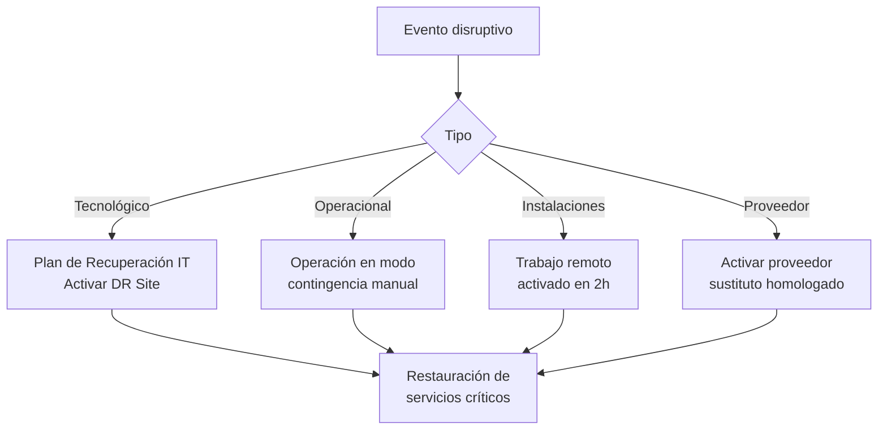

# Política de Continuidad de Negocio

**Versión:** 1.0  
**Fecha:** 2026-06-02  
**Propietario:** COO + CISO  
**Marco:** ISO 22301:2019  
**Revisión:** Anual

---

## 1. Objetivo

Garantizar la capacidad de la organización para continuar operando sus funciones críticas ante la materialización de eventos disruptivos, minimizando el impacto sobre clientes, empleados, accionistas y la sociedad.

---

## 2. Alcance del BCP

El Plan de Continuidad de Negocio (BCP) cubre:

- Falla total o parcial de infraestructura tecnológica.
- Ciberataque o ransomware.
- Desastre natural (terremoto, inundación, incendio).
- Pandemia o crisis sanitaria.
- Falla de proveedores críticos.
- Crisis reputacional severa.

---

## 3. Análisis de Impacto al Negocio (BIA)

### Procesos críticos y sus RTO/RPO

| Proceso | Criticidad | RTO | RPO | Alternativa |
|---|---|---|---|---|
| Procesamiento de pagos | Crítico | 1 hora | 15 min | Proveedor alterno activo |
| Plataforma operativa core | Crítico | 2 horas | 30 min | Failover automático cloud |
| CRM / Atención al cliente | Alto | 4 horas | 1 hora | Modo degradado manual |
| Data Warehouse / BI | Medio | 24 horas | 4 horas | Reportes estáticos |
| ERP Financiero | Alto | 8 horas | 2 horas | Modo contingencia offline |
| Comunicaciones internas | Medio | 2 horas | N/A | Canal alterno (móvil) |

**RTO:** Recovery Time Objective — tiempo máximo para restaurar el servicio  
**RPO:** Recovery Point Objective — pérdida máxima de datos aceptable

---

## 4. Estrategias de Recuperación



---

## 5. Equipo de Gestión de Crisis

| Rol | Nombre del puesto | Responsabilidad en crisis |
|---|---|---|
| **Líder de Crisis** | CEO | Decisión final, comunicación externa |
| **Coordinador Técnico** | CTO/CISO | Recuperación sistemas, análisis forense |
| **Coordinador Operativo** | COO | Continuidad procesos, personal |
| **Comunicaciones** | CMO | Mensajes a clientes, prensa, RRSS |
| **Financiero** | CFO | Autorización gastos de emergencia |
| **Legal** | Chief Legal Officer | Cumplimiento regulatorio, contratos |

---

## 6. Árbol de Comunicación de Crisis

```
CEO
├── Junta Directiva (inmediato si Crítico)
├── CTO/CISO (activación técnica)
├── COO (operaciones)
├── CMO (comunicación)
└── CFO (recursos)
    └── Empleados (según severidad)
    └── Clientes (dentro de SLA comprometido)
    └── Reguladores (si requerido por ley)
    └── Prensa (controlado por CMO)
```

---

## 7. Pruebas y Mantenimiento del BCP

| Tipo de prueba | Frecuencia | Participantes | Resultado esperado |
|---|---|---|---|
| Walkthrough documental | Semestral | Equipo de crisis | Plan actualizado |
| Simulacro tabletop | Anual | Directivos | Identificar brechas |
| Prueba técnica de failover | Semestral | IT | RTO/RPO verificados |
| Ejercicio completo | Bianual | Toda la org | Validación integral |

---

## 8. Métricas de BCP

| KPI | Meta | Frecuencia de medición |
|---|---|---|
| % sistemas con DR documentado | 100% | Trimestral |
| % BCP actualizado en últimos 12 meses | 100% | Anual |
| RTO real vs objetivo (últimas pruebas) | ≤ 100% | Por simulacro |
| % empleados capacitados en BCP | ≥ 90% | Anual |

---

**Aprobado por:** Comité de Gobierno Corporativo  
**Próxima revisión:** 2027-06-01
