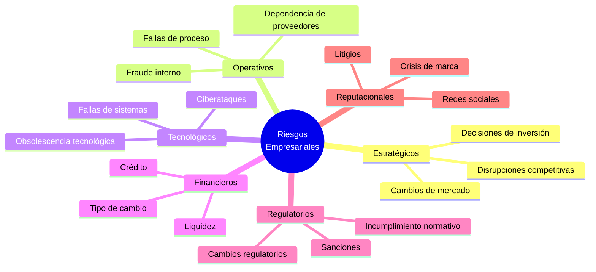
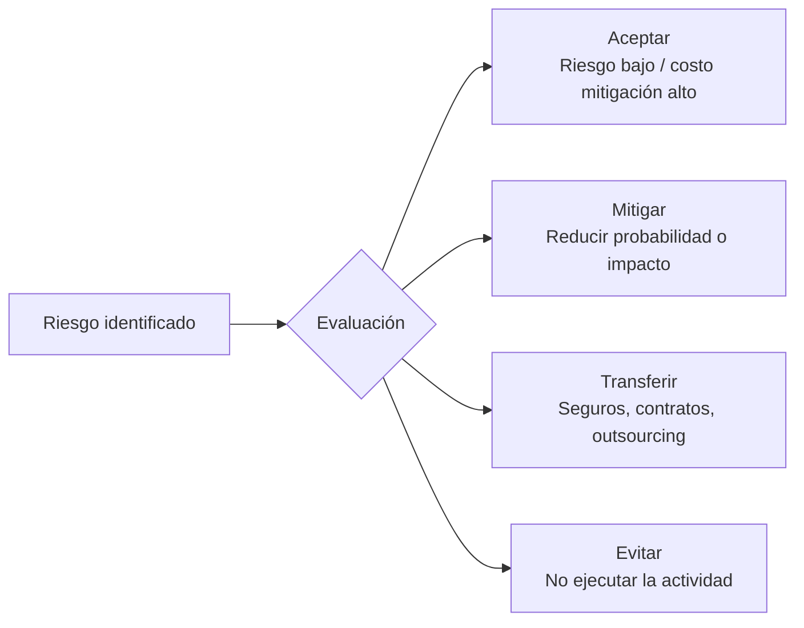
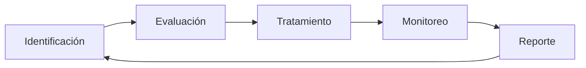

# Política de Gestión de Riesgos

**Versión:** 1.0  
**Fecha:** 2026-06-02  
**Propietario:** Chief Risk Officer (CRO)  
**Marco:** ISO 31000:2018 + COSO ERM  
**Revisión:** Semestral

---

## 1. Objetivo

Identificar, evaluar, tratar y monitorear los riesgos que puedan afectar el logro de los objetivos estratégicos, operativos, financieros y de cumplimiento de la organización.

---

## 2. Universo de Riesgos



---

## 3. Metodología de Evaluación de Riesgos

### Escala de Probabilidad

| Nivel | Valor | Descripción | Frecuencia referencial |
|---|---|---|---|
| Raro | 1 | Muy poco probable | < 1 vez en 10 años |
| Improbable | 2 | Puede ocurrir | 1 vez en 5-10 años |
| Posible | 3 | Probable que ocurra | 1 vez en 2-5 años |
| Probable | 4 | Es más probable que ocurra | 1 vez por año |
| Casi Cierto | 5 | Se espera que ocurra | Múltiples veces al año |

### Escala de Impacto

| Nivel | Valor | Financiero | Operacional | Reputacional |
|---|---|---|---|---|
| Insignificante | 1 | < $10K | Sin interrupción | Queja individual |
| Menor | 2 | $10K–$100K | < 4 horas | Cobertura local |
| Moderado | 3 | $100K–$1M | 4–24 horas | Cobertura sectorial |
| Mayor | 4 | $1M–$10M | 1–7 días | Cobertura nacional |
| Catastrófico | 5 | > $10M | > 7 días | Cobertura internacional |

### Mapa de Calor

```
Impacto ↑
    5 | M  M  H  H  C
    4 | M  M  H  H  C
    3 | L  M  M  H  H
    2 | L  L  M  M  H
    1 | L  L  L  M  M
      +──────────────→ Probabilidad
        1  2  3  4  5

L=Bajo  M=Medio  H=Alto  C=Crítico
```

### Nivel de Riesgo = Probabilidad × Impacto

| Resultado | Nivel | Acción requerida |
|---|---|---|
| 1–4 | Bajo | Aceptar y monitorear |
| 5–9 | Medio | Mitigar y monitorear mensualmente |
| 10–16 | Alto | Mitigar urgente y reportar al Comité |
| 17–25 | Crítico | Escalada inmediata al CEO/Directorio |

---

## 4. Tratamiento de Riesgos



---

## 5. Apetito y Tolerancia al Riesgo

| Categoría | Apetito | Tolerancia máxima |
|---|---|---|
| Riesgo estratégico | Medio | Alto (buscar crecimiento) |
| Riesgo operacional | Bajo | Medio |
| Riesgo financiero | Bajo | Bajo |
| Riesgo reputacional | Muy bajo | Bajo |
| Riesgo regulatorio | Cero | Bajo |

---

## 6. Roles y Responsabilidades

| Rol | Responsabilidad |
|---|---|
| **Directorio** | Aprueba apetito al riesgo, supervisa riesgos críticos |
| **CEO** | Lidera cultura de gestión de riesgos |
| **CRO** | Metodología, reporte consolidado, monitoreo |
| **Risk Owners** | Identifican, evalúan y tratan riesgos en su área |
| **Auditoría Interna** | Evaluación independiente del sistema de gestión |

---

## 7. Ciclo de Gestión



**Frecuencia:**
- Identificación completa: Anual (+ ad-hoc ante cambios mayores)
- Evaluación y actualización: Trimestral
- Monitoreo de indicadores de riesgo (KRI): Mensual
- Reporte al Comité: Trimestral
- Reporte al Directorio: Semestral

---

## 8. Indicadores Clave de Riesgo (KRI)

| KRI | Umbral Verde | Umbral Amarillo | Umbral Rojo |
|---|---|---|---|
| Riesgos críticos abiertos | 0 | 1 | ≥ 2 |
| Riesgos altos sin plan de mitigación | 0 | ≤ 2 | ≥ 3 |
| Incidentes operativos por mes | ≤ 2 | 3–5 | ≥ 6 |
| Días promedio de cierre de riesgo | ≤ 30 | 31–60 | ≥ 61 |
| % riesgos con dueño asignado | 100% | 90–99% | < 90% |

---

**Aprobado por:** Comité de Gobierno Corporativo  
**Próxima revisión:** 2026-12-01
