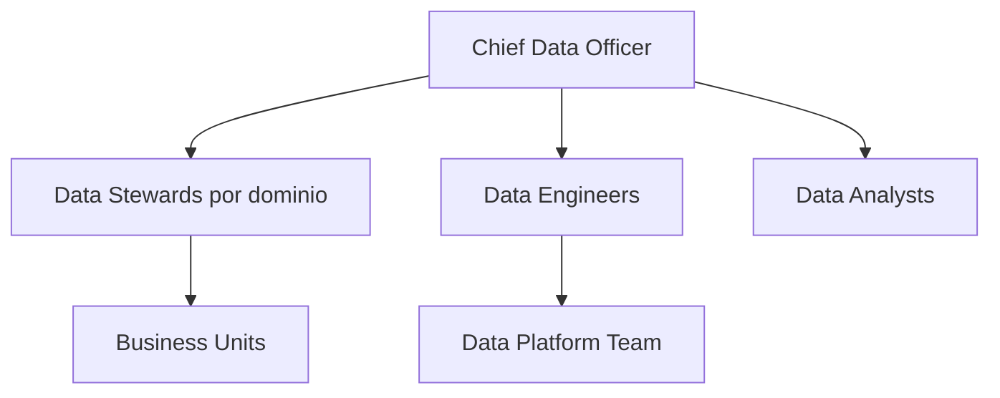
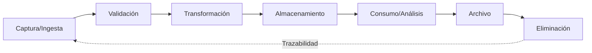

# Política de Gobierno de Datos

**Versión:** 1.0  
**Fecha:** 2026-06-02  
**Propietario:** Chief Data Officer (CDO)  
**Clasificación:** Interno — Uso corporativo  
**Revisión:** Semestral

---

## 1. Objetivo

Establecer los principios, responsabilidades y controles para la gestión del ciclo de vida de los datos en la organización, garantizando su calidad, seguridad, disponibilidad y uso ético.

---

## 2. Alcance

Esta política aplica a:

- Todos los datos generados, procesados o almacenados por la organización.
- Todos los colaboradores, proveedores y sistemas que accedan a datos corporativos.
- Plataformas tecnológicas: ERP, CRM, Data Warehouse, Data Lake, APIs.

---

## 3. Principios de Gobierno de Datos

| Principio | Descripción |
|---|---|
| **Veracidad** | Los datos deben reflejar la realidad del negocio |
| **Completitud** | Sin campos críticos nulos en registros maestros |
| **Consistencia** | Mismas definiciones en todos los sistemas |
| **Oportunidad** | Datos disponibles cuando se necesitan |
| **Trazabilidad** | Origen, transformaciones y uso deben ser auditables |
| **Privacidad** | Cumplimiento con GDPR / Ley de Protección de Datos local |
| **Seguridad** | Acceso por rol, cifrado en reposo y en tránsito |

---

## 4. Roles y Responsabilidades

| Rol | Responsabilidades |
|---|---|
| **CDO** | Estrategia de datos, aprobación de políticas, reporting al Comité |
| **Data Steward** | Calidad de datos en su dominio, diccionario, linaje |
| **Data Engineer** | Pipelines, transformaciones, integraciones |
| **Data Analyst** | Consumo, KPIs, dashboards, alertas |
| **Dueño del Dato** | Responsable de negocio por la exactitud del dato |

---

## 5. Clasificación de Datos

| Nivel | Descripción | Ejemplos | Controles |
|---|---|---|---|
| **Público** | Sin restricción | Tarifas, horarios públicos | Ninguno adicional |
| **Interno** | Uso corporativo | KPIs, reportes internos | Autenticación |
| **Confidencial** | Restricción selectiva | Datos financieros, estrategia | Cifrado + acceso por rol |
| **Secreto** | Máxima restricción | Datos de clientes PII, contraseñas | Cifrado AES-256 + MFA + auditoría |

---

## 6. Calidad de Datos — Dimensiones y Umbrales

| Dimensión | Métrica | Umbral Mínimo | Acción si falla |
|---|---|---|---|
| Completitud | % campos requeridos completos | ≥ 98% | Alerta al Data Steward |
| Exactitud | % registros sin errores de formato | ≥ 99% | Pipeline de corrección |
| Unicidad | % registros duplicados | ≤ 0.1% | Deduplicación automática |
| Vigencia | % datos actualizados en SLA | ≥ 95% | Escalada a Data Engineer |
| Consistencia | % referencias cruzadas válidas | ≥ 99.5% | Validación referencial |

---

## 7. Ciclo de Vida del Dato

### Retención

| Tipo de dato | Retención activa | Archivo frío | Eliminación |
|---|---|---|---|
| Transaccional | 2 años | 5 años | Año 7 |
| Maestros | Vigente | 3 años post-baja | Año 5 |
| Logs de auditoría | 1 año | 4 años | Año 5 |
| PII de clientes | Vigente relación | 2 años post-relación | Según normativa |

---

## 8. Controles de Acceso

- Acceso basado en roles (RBAC) en todas las plataformas.
- Autenticación multifactor (MFA) obligatoria para datos Confidencial y Secreto.
- Revisión trimestral de permisos.
- Log de acceso a datos sensibles en sistema SIEM.

---

## 9. Incumplimiento

El incumplimiento de esta política puede derivar en:

1. Amonestación formal documentada.
2. Revocación de accesos.
3. Acciones legales según normativa aplicable.
4. Notificación a autoridades reguladoras si hay brecha de datos PII.

---

## 10. Revisión y Vigencia

Esta política se revisa semestralmente o ante cambios regulatorios significativos. La versión vigente siempre es la registrada en este repositorio Git.

**Aprobado por:** Comité de Gobierno Corporativo  
**Próxima revisión:** 2026-12-01
