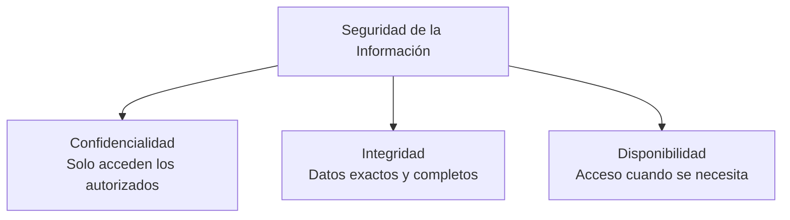
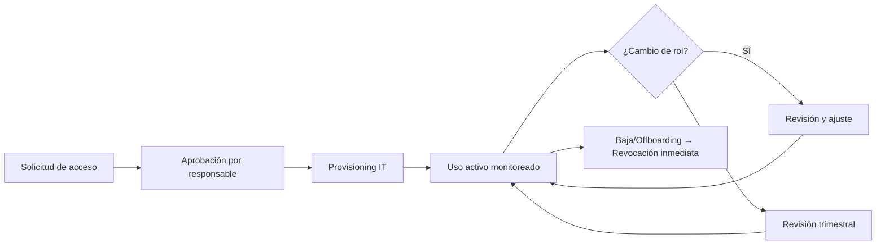
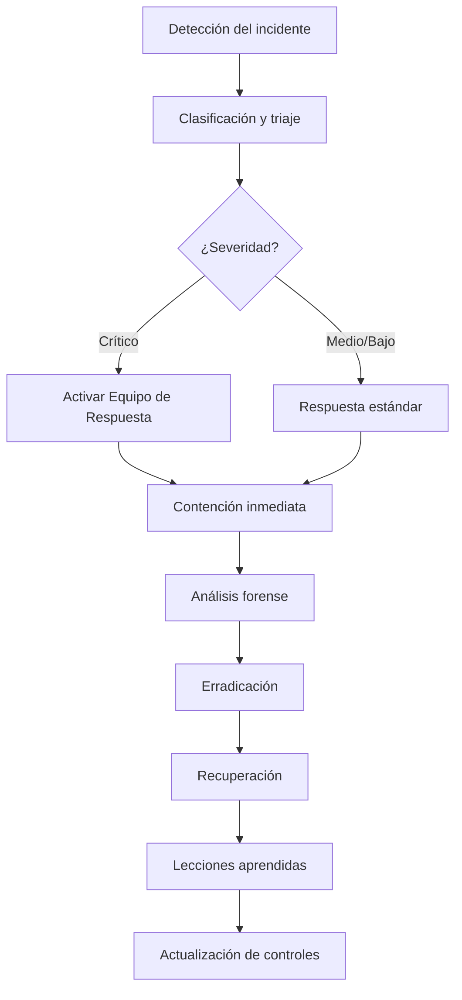

# Política de Seguridad de la Información

**Versión:** 1.0  
**Fecha:** 2026-06-02  
**Propietario:** Chief Information Security Officer (CISO)  
**Marco de referencia:** ISO/IEC 27001:2022  
**Revisión:** Anual

---

## 1. Objetivo

Proteger la confidencialidad, integridad y disponibilidad (triada CIA) de los activos de información de la organización frente a amenazas internas y externas.

---

## 2. Triada CIA — Controles por Dimensión

---

## 3. Gestión de Activos de Información

### Inventario de activos críticos

| ID | Activo | Clasificación | Responsable | Criticidad |
|---|---|---|---|---|
| ACT-001 | Base de datos de clientes | Secreto | CDO | Alta |
| ACT-002 | ERP / Sistemas financieros | Confidencial | CFO | Alta |
| ACT-003 | Código fuente | Confidencial | CTO | Alta |
| ACT-004 | Data Warehouse | Confidencial | CDO | Alta |
| ACT-005 | Infraestructura cloud | Interno | CTO | Alta |
| ACT-006 | Correo corporativo | Interno | CISO | Media |

---

## 4. Control de Acceso

### Principios

- **Mínimo privilegio:** Solo los permisos necesarios para la función.
- **Necesidad de conocer:** Acceso solo a los datos del alcance del rol.
- **Separación de funciones:** Nadie aprueba lo que también ejecuta.

### Ciclo de vida de accesos

---

## 5. Gestión de Vulnerabilidades

| Criticidad | Tiempo de remediación | Notificación |
|---|---|---|
| Crítica (CVSS ≥ 9.0) | 24 horas | CISO + CEO |
| Alta (CVSS 7.0–8.9) | 72 horas | CISO + CTO |
| Media (CVSS 4.0–6.9) | 30 días | CTO |
| Baja (CVSS < 4.0) | 90 días | Equipo técnico |

---

## 6. Seguridad en el Desarrollo (DevSecOps)

- Análisis de código estático (SAST) en pipeline CI/CD.
- Análisis de dependencias (SCA) — sin librerías con CVE crítico.
- Pruebas de penetración anuales y ante cambios mayores.
- Revisión de código obligatoria antes de merge a producción.
- Secrets nunca en código fuente — usar vault o variables de entorno.

---

## 7. Gestión de Incidentes de Seguridad

**SLA de respuesta:**
- Detección → Notificación CISO: ≤ 1 hora
- Contención: ≤ 4 horas (crítico), ≤ 24 horas (alto)
- Recuperación: ≤ 24 horas (crítico), ≤ 72 horas (alto)

---

## 8. Seguridad Física y del Entorno

- Acceso a centro de datos con doble autenticación (tarjeta + biométrico).
- CCTV con retención de 90 días.
- Visitantes con registro y acompañamiento permanente.
- Destrucción de medios de almacenamiento certificada (DoD 5220.22-M).

---

## 9. Concienciación y Formación

| Actividad | Frecuencia | Audiencia | Responsable |
|---|---|---|---|
| Inducción seguridad | Al ingreso | Todos | RRHH + CISO |
| Phishing simulado | Trimestral | Todos | CISO |
| Formación técnica avanzada | Anual | IT/Dev | CISO + CTO |
| Ejercicio de crisis | Anual | Comité Directivo | CISO + CEO |

---

## 10. Cumplimiento

Esta política se alinea con:

- ISO/IEC 27001:2022
- NIST Cybersecurity Framework 2.0
- Ley de Protección de Datos Personales local
- GDPR (si aplica por operaciones en UE)

**Aprobado por:** Comité de Gobierno Corporativo  
**Próxima revisión:** 2027-06-01
