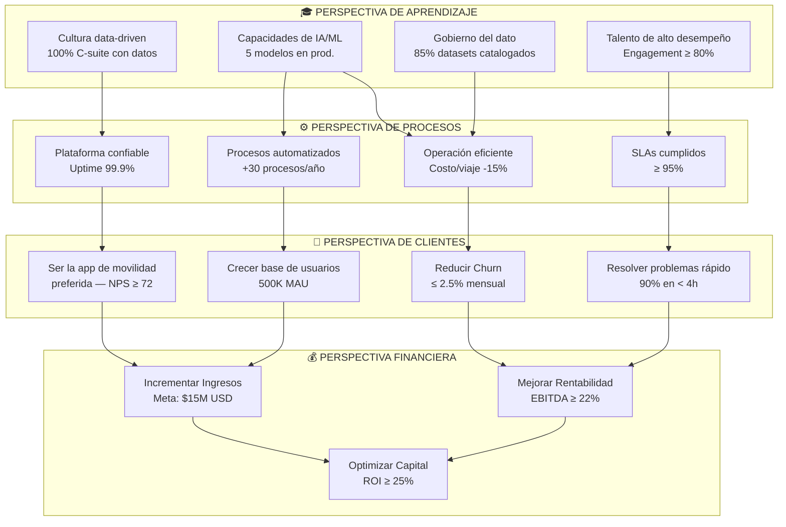
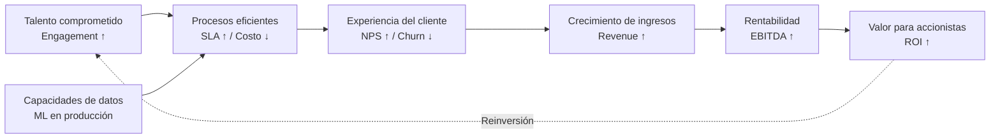
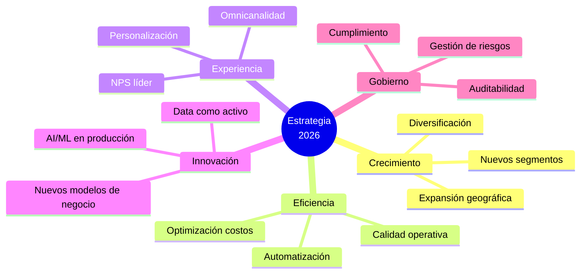

# Mapa Estratégico — Balanced Scorecard

**Versión:** 1.0  
**Fecha:** 2026-06-02  
**Marco:** Balanced Scorecard (Kaplan & Norton)

---

## Mapa Estratégico Visual

---

## Perspectiva Financiera

### Objetivo estratégico: Crecimiento sostenible y rentable

| KPI | Baseline | Meta 2026 | Tendencia objetivo |
|---|---|---|---|
| Ingresos totales | $10.5M | $15.0M (+43%) | ↑ |
| EBITDA margin | 17.5% | 22.0% | ↑ |
| ROI de inversiones | 18% | 25% | ↑ |
| Flujo de caja operativo | $1.8M | $3.2M | ↑ |
| CAC | $10.0 | $8.0 (-20%) | ↓ |
| LTV | $110 | $140 (+27%) | ↑ |
| LTV/CAC ratio | 11x | 17.5x | ↑ |

**Iniciativas financieras clave:**
1. Diversificación de ingresos (nuevos servicios premium)
2. Optimización de estructura de costos por automatización
3. Expansión geográfica con bajo CAPEX

---

## Perspectiva de Clientes

### Objetivo estratégico: Ser la plataforma de movilidad preferida

| KPI | Baseline | Meta 2026 | Tendencia objetivo |
|---|---|---|---|
| NPS | 58 | 72 | ↑ |
| CSAT (satisfacción por viaje) | 3.9/5 | 4.5/5 | ↑ |
| Usuarios Activos Mensuales | 320K | 500K | ↑ |
| Churn mensual | 4.2% | 2.5% | ↓ |
| Tiempo medio resolución | 6.2h | 3.5h | ↓ |
| First Contact Resolution | 62% | 82% | ↑ |
| Rating app store | 3.8 | 4.6 | ↑ |

**Iniciativas de clientes clave:**
1. Rediseño de experiencia en app (UX Research)
2. Programa de fidelización con beneficios tangibles
3. Canal de atención omnicanal con respuesta en < 2h
4. Personalización de la experiencia por segmento

---

## Perspectiva de Procesos Internos

### Objetivo estratégico: Operación confiable, eficiente y escalable

| KPI | Baseline | Meta 2026 | Tendencia objetivo |
|---|---|---|---|
| Uptime plataforma | 98.5% | 99.9% | ↑ |
| MTTR (Mean Time to Recover) | 4.2h | 1.5h | ↓ |
| Costo por viaje | $1.85 | $1.57 | ↓ |
| SLA cumplimiento % | 87% | 95% | ↑ |
| Procesos automatizados | 12 | 42 | ↑ |
| Lead time de nuevas features | 21 días | 10 días | ↓ |
| Incidentes críticos/mes | 3.2 | ≤ 1 | ↓ |

**Iniciativas de procesos clave:**
1. Implementación de plataforma DevOps/SRE
2. Automatización RPA de procesos administrativos
3. Optimización de rutas con ML (ahorro combustible)
4. Control tower operativo con alertas en tiempo real

---

## Perspectiva de Aprendizaje y Crecimiento

### Objetivo estratégico: Construir las capacidades del futuro

| KPI | Baseline | Meta 2026 | Tendencia objetivo |
|---|---|---|---|
| Employee Engagement | 64% | 82% | ↑ |
| Rotación voluntaria | 18% | ≤ 10% | ↓ |
| Horas capacitación/empleado/año | 24h | 48h | ↑ |
| Modelos ML en producción | 0 | 5 | ↑ |
| Datasets catalogados | 20% | 85% | ↑ |
| C-suite data-driven decisions | 30% | 100% | ↑ |
| Índice de innovación (ideas → prod) | 2% | 8% | ↑ |

**Iniciativas de aprendizaje clave:**
1. Academia interna de datos y analítica
2. Programa de AI Champions en cada área
3. Implementación de Data Lakehouse y gobierno del dato
4. Plan de carrera para retención de talento técnico

---

## Relaciones de Causalidad

---

## Temas Estratégicos

---

*El Mapa Estratégico se revisa trimestralmente en el Comité Estratégico y se actualiza según los cambios en el contexto competitivo y los resultados obtenidos.*
