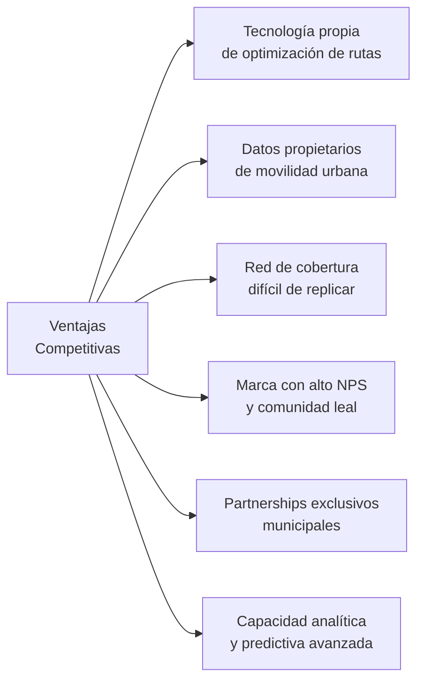
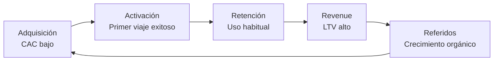

# Modelo de Negocio — Business Model Canvas

**Versión:** 1.0  
**Fecha:** 2026-06-02  
**Sector de referencia:** Operador de Movilidad / Transporte Urbano (adaptable)

---

## Business Model Canvas

```
┌─────────────────┬──────────────┬─────────────────┬──────────────┬─────────────────┐
│  SOCIOS CLAVE   │ACTIVIDADES   │  PROPUESTA DE   │ RELACIONES   │SEGMENTOS DE     │
│                 │  CLAVE       │     VALOR       │CON CLIENTES  │CLIENTES         │
│ • Proveedores   │              │                 │              │                 │
│   de vehículos  │ • Operación  │ • Transporte    │ • App móvil  │ • Usuarios       │
│ • Plataformas   │   de flota   │   seguro y      │  24/7        │  urbanos daily  │
│   de pago       │              │   puntual       │              │                 │
│ • Municipios    │ • Tecnología │                 │ • Atención   │ • Empresas con  │
│ • Aseguradoras  │   y datos    │ • Precio justo  │  al cliente  │  flotas         │
│ • Operadores    │              │   y predecible  │              │                 │
│   logísticos    │ • Marketing  │                 │ • Comunidad  │ • Turistas y    │
│                 │  digital     │ • Experiencia   │  de usuarios │  visitantes     │
│ • Inversionistas│              │   superior      │              │                 │
│                 │ • Analítica  │                 │ • Programas  │ • Sector        │
│                 │  y mejora    │ • Cobertura     │  de lealtad  │  gobierno       │
│                 │  continua    │  amplia         │              │                 │
├─────────────────┴──────────────┼─────────────────┴──────────────┴─────────────────┤
│       RECURSOS CLAVE           │              CANALES                             │
│                                │                                                  │
│ • Flota de vehículos           │ • App móvil (iOS / Android)                     │
│ • Plataforma tecnológica       │ • Web / PWA                                     │
│ • Datos de movilidad           │ • Puntos físicos de recarga                     │
│ • Licencias operativas         │ • Partnerships con empresas                     │
│ • Equipo operativo             │ • Canales digitales (SEO, SEM, RRSS)            │
│ • Marca y reputación           │ • API para integradores                         │
├────────────────────────────────┼──────────────────────────────────────────────────┤
│       ESTRUCTURA DE COSTOS     │           FUENTES DE INGRESOS                   │
│                                │                                                  │
│ • Mantenimiento de flota (35%) │ • Tarifa por viaje / suscripción (70%)          │
│ • Personal operativo (25%)     │ • Servicios corporativos (15%)                  │
│ • Tecnología / Cloud (15%)     │ • Publicidad en plataforma (8%)                 │
│ • Marketing (10%)              │ • Datos de movilidad anonimizados (4%)          │
│ • Overhead administrativo (15%)│ • Servicios de valor añadido (3%)               │
└────────────────────────────────┴──────────────────────────────────────────────────┘
```

---

## Propuesta de Valor Detallada

### Para usuarios individuales

| Problema del cliente | Nuestra solución | Diferenciador |
|---|---|---|
| Transporte impredecible | Tiempos reales y garantizados | Algoritmo de predicción propio |
| Precio variable e injusto | Tarifa transparente y fija | Precio publicado antes del viaje |
| Experiencia degradante | App intuitiva, vehículo limpio | NPS objetivo > 70 |
| Inseguridad | Conductores certificados, monitoreo | Sistema de reputación 5 estrellas |
| Sin opciones de pago | Múltiples medios de pago | Tarjeta, QR, wallet, efectivo |

---

## Misión

> **Conectar personas y oportunidades a través de soluciones de movilidad inteligente, seguras, asequibles y sostenibles, mejorando la calidad de vida urbana.**

---

## Visión 2030

> **Ser el operador de movilidad de referencia en Latinoamérica, líder en experiencia del usuario, sostenibilidad y uso de datos para optimizar el ecosistema urbano.**

---

## Valores Corporativos

| Valor | Definición operativa | Cómo se mide |
|---|---|---|
| **Seguridad** | Cero accidentes graves es el único estándar aceptable | Tasa de accidentes por millón de km |
| **Confiabilidad** | Cumplimos lo que prometemos, siempre | % viajes en tiempo prometido |
| **Innovación** | Usamos datos y tecnología para mejorar cada día | Features lanzados / trimestre |
| **Sostenibilidad** | Reducimos huella de carbono activamente | kg CO2 / viaje (tendencia) |
| **Transparencia** | Operamos con integridad total ante clientes y accionistas | NPS + score auditoría interna |

---

## Ventajas Competitivas



### Moat (foso competitivo)

1. **Datos:** Cada viaje genera datos que mejoran el algoritmo — ventaja acumulativa.
2. **Efectos de red:** Más usuarios → mejor cobertura → más usuarios (loop virtuoso).
3. **Contratos municipales:** Barreras regulatorias de entrada.
4. **Costos de cambio:** Historial, puntos de lealtad, hábito de uso.

---

## Unit Economics

| Métrica | Valor objetivo | Descripción |
|---|---|---|
| **CAC** (Costo de adquisición) | ≤ $8 USD | Costo para adquirir un nuevo usuario activo |
| **LTV** (Valor de vida del cliente) | ≥ $120 USD | Revenue total esperado por usuario |
| **LTV/CAC ratio** | ≥ 15x | Sostenibilidad del modelo |
| **Payback period** | ≤ 6 meses | Tiempo para recuperar el CAC |
| **Ticket promedio por viaje** | $2.50 USD | Ingreso por transacción |
| **Frecuencia de uso** | 18 viajes/mes | Viajes por usuario activo mensual |
| **Churn mensual** | ≤ 3% | % usuarios que dejan de usar |
| **Margen bruto** | ≥ 45% | Ingresos menos costos variables directos |

---

## Modelo de Crecimiento



**Estrategia de crecimiento prioritaria:** Expansión geográfica + upselling de servicios premium.
