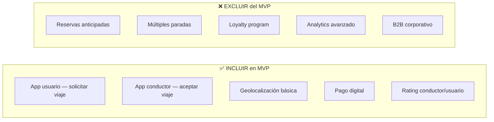
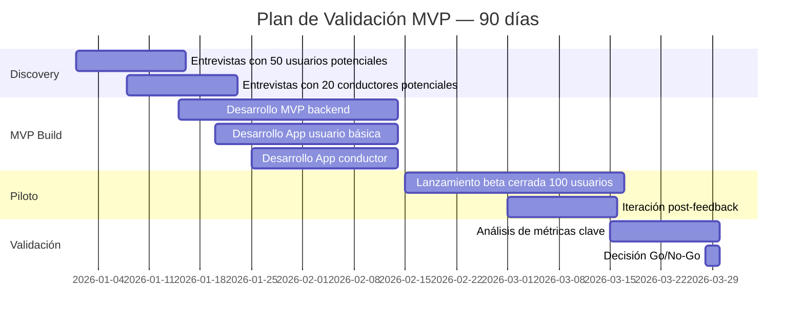

# Fase 1 — Creación y Validación

**Etapa:** 0 a 18 meses  
**Objetivo:** Validar que el problema existe, la solución funciona y el modelo de negocio es sostenible.

---

## 1. Idea y Problema

### Canvas del Problema

| Pregunta | Respuesta validada |
|---|---|
| **¿Qué problema resolvemos?** | El transporte urbano es impredecible, inseguro e ineficiente |
| **¿Para quién?** | Usuarios urbanos 18-45 años que se mueven diariamente |
| **¿Qué solución alternativa usan hoy?** | Taxis informales, transporte público congestionado, autos propios |
| **¿Cuál es el costo del problema?** | 2h/día perdidas + inseguridad + costos variables |
| **¿Por qué ahora?** | Adopción masiva de smartphones + urbanización acelerada |

### Hipótesis a validar (Fase 1)

```
H1: Los usuarios pagarían $2.50 por un viaje garantizado y seguro
H2: Conductores independientes se unen a la plataforma por ingresos > 20% vs status quo
H3: El ticket promedio permite margen positivo con 15+ viajes/día por vehículo
H4: El NPS > 60 se logra desde el MVP sin features avanzados
```

---

## 2. MVP (Producto Mínimo Viable)

### Alcance del MVP



### Stack tecnológico MVP

| Componente | Tecnología MVP | Justificación |
|---|---|---|
| Backend | Node.js + PostgreSQL | Velocidad de desarrollo |
| App móvil | React Native (único codebase) | iOS + Android simultáneo |
| Geolocalización | Google Maps API | Rápido de integrar |
| Pagos | Stripe / Mercado Pago | Sin desarrollo propio |
| Hosting | AWS / Railway.app | Bajo costo inicial |
| Monitoring | Sentry + UptimeRobot | Gratuito en early stage |

---

## 3. Validación de Mercado

### Plan de validación — 90 días



### Criterios de éxito del MVP (Go/No-Go)

| Métrica | Umbral mínimo para continuar | ¿Logrado? |
|---|---|---|
| Usuarios en piloto que repiten 3+ veces | ≥ 40% | Por validar |
| NPS piloto | ≥ 50 | Por validar |
| Ratio de completud de viajes | ≥ 85% | Por validar |
| Conductores activos tras 30 días | ≥ 70% retention | Por validar |
| CAC en piloto | ≤ $15 USD | Por validar |

---

## 4. Costos Iniciales (Pre-seed / Seed)

### Inversión requerida primeros 18 meses

| Categoría | Monto (USD) | % del total | Desglose |
|---|---|---|---|
| **Desarrollo de producto** | $180,000 | 36% | 3 devs × 12 meses + CTO |
| **Operaciones** | $120,000 | 24% | Flota inicial 15 vehículos (leasing) |
| **Marketing y adquisición** | $80,000 | 16% | Digital + grassroots + referidos |
| **Infraestructura tech** | $25,000 | 5% | Cloud + herramientas |
| **Legal y regulatorio** | $30,000 | 6% | Licencias, contratos, estructura legal |
| **Equipo fundador + ops** | $50,000 | 10% | Salarios mínimos founding team |
| **Reserva / imprevistos** | $15,000 | 3% | Colchón operativo |
| **TOTAL** | **$500,000** | 100% | Runway: ~18 meses |

### Roadmap de financiamiento

```
Pre-seed (Bootstrapping / FFF):  $100K  → Meses 1-3 (MVP)
Seed round:                       $500K  → Meses 4-18 (Validación + Lanzamiento)
Serie A:                         $3-5M  → Mes 18+ (si métricas lo justifican)
```

---

## 5. KPIs de la Fase de Creación

| KPI | Meta al mes 6 | Meta al mes 12 | Meta al mes 18 |
|---|---|---|---|
| Usuarios registrados | 1,000 | 10,000 | 50,000 |
| Usuarios activos mensuales (MAU) | 500 | 5,000 | 25,000 |
| Viajes por día | 50 | 500 | 2,500 |
| NPS | ≥ 50 | ≥ 58 | ≥ 62 |
| Tasa de retención (30 días) | ≥ 40% | ≥ 50% | ≥ 55% |
| CAC | ≤ $15 | ≤ $12 | ≤ $10 |
| Runway restante | > 12 meses | > 6 meses | ≥ 3 meses o Serie A |

---

## 6. Riesgos de la Fase de Creación

| Riesgo | Mitigación |
|---|---|
| No encontrar product-market fit | Pivotar basado en datos de usuario, no en intuición |
| Quedarse sin cash antes de tracción | Fundraising paralelo al desarrollo del MVP |
| Problemas regulatorios | Involucrar abogados especializados desde el día 1 |
| No conseguir conductores suficientes | Incentivos de lanzamiento, garantía de ingresos mínimos |
| Calidad inconsistente del servicio | Proceso de onboarding y certificación de conductores |

---

## 7. Hitos de la Fase de Creación

- [ ] Empresa legalmente constituida
- [ ] MVP lanzado (beta cerrada)
- [ ] 100 usuarios en piloto
- [ ] Primer feedback loop completado
- [ ] Product-market fit señales positivas
- [ ] Seed round cerrado
- [ ] 1,000 usuarios registrados
- [ ] Primera cohorte de retención > 40%
- [ ] Equipo core de 8 personas
- [ ] Go para Fase 2 (Crecimiento)
