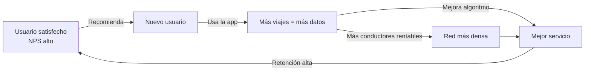
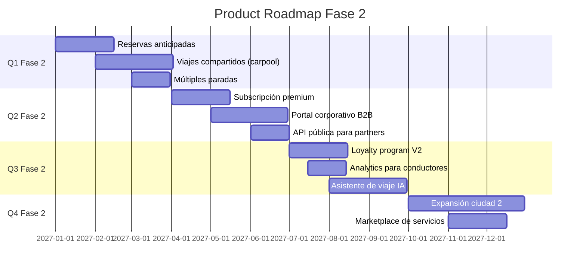

# Fase 2 — Crecimiento y Escalamiento

**Etapa:** 18 a 48 meses  
**Objetivo:** Escalar el modelo validado, optimizar unit economics y construir ventajas competitivas duraderas.

---

## 1. Señales de Product-Market Fit (entrada a Fase 2)

Antes de escalar, deben verificarse estas señales:

| Señal | Umbral mínimo |
|---|---|
| NPS | ≥ 60 |
| Retención a 90 días | ≥ 40% |
| Crecimiento orgánico (referidos) | ≥ 30% de nuevos usuarios |
| LTV/CAC ratio | ≥ 3x |
| Margen bruto por viaje | > 0 (unidad positiva) |
| Usuarios que lo recomendarían a amigos | ≥ 70% en encuesta |

---

## 2. Estrategia de Escalamiento

### Motor de crecimiento



### Canales de adquisición prioritarios

| Canal | % de adquisición objetivo | CAC esperado | Notas |
|---|---|---|---|
| Referidos / Boca a boca | 35% | $2 | El más eficiente — nutrir activamente |
| SEO / Contenido | 20% | $5 | Escala con tiempo, sin costo marginal |
| Performance marketing (SEM/Meta) | 25% | $12 | Controlable y medible |
| Alianzas corporativas | 15% | $3 | B2B con factura corporativa |
| Eventos y comunidades | 5% | $8 | Branding + conversión directa |

---

## 3. Marketing — Framework Completo

### Funnel de adquisición

```
Awareness (alcanzar al mercado objetivo)
    ↓ 100,000 impresiones/mes
Consideración (interés activo)
    ↓ 15,000 visitas/mes a la web (CTR 15%)
Descarga / Registro
    ↓ 3,000 nuevas instalaciones/mes (CVR 20%)
Activación (primer viaje completado)
    ↓ 1,800 usuarios activados/mes (Activación 60%)
Retención (uso recurrente)
    ↓ 900 usuarios con ≥3 viajes/mes (Retención 50%)
Revenue (generación de ingresos)
    ↓ $2,250 revenue incremental por cohorte de mes
Referidos
    ↓ 270 referidos orgánicos (30% de los retenidos)
```

### Unit Economics objetivo — Fase 2

| Métrica | Entrada Fase 2 | Meta al final Fase 2 |
|---|---|---|
| CAC blended | $10 | $7 |
| LTV (24 meses) | $120 | $180 |
| LTV/CAC | 12x | 26x |
| Payback period | 8 meses | 4 meses |
| Margen bruto por viaje | $0.85 | $1.15 |
| Frecuencia de uso (viajes/mes) | 12 | 22 |
| Ticket promedio por viaje | $2.50 | $3.20 |

---

## 4. Expansión de Producto

### Roadmap de features — Fase 2



---

## 5. Automatización Inicial

### Procesos a automatizar en Fase 2

| Proceso | Herramienta | Impacto esperado |
|---|---|---|
| Onboarding de conductores | Flujo automatizado en app | -80% tiempo de CS |
| Facturación corporativa | ERP + integración bancaria | -70% tiempo contable |
| Gestión de incidencias nivel 1 | Chatbot + reglas | -50% volumen CS humano |
| Reporte de KPIs diarios | Python + email automático | 2h/día ahorradas |
| Matching conductor-usuario | ML de optimización | +15% tasa de aceptación |
| Detección de fraude | Reglas + ML | -90% fraude no detectado |
| Precios dinámicos (surge) | Algoritmo de demanda | +8% revenue en picos |

---

## 6. Estructura de Costos — Fase 2

### P&L simplificado objetivo (Año 3)

| Línea | Año 1 (Creación) | Año 2 | Año 3 (Final F2) |
|---|---|---|---|
| **Ingresos** | $800K | $3.2M | $8.5M |
| Costo de servicio | ($520K) | ($1.9M) | ($4.5M) |
| **Margen bruto** | **$280K (35%)** | **$1.3M (41%)** | **$4.0M (47%)** |
| Marketing y ventas | ($200K) | ($640K) | ($1.3M) |
| Tecnología y ops | ($180K) | ($480K) | ($900K) |
| G&A | ($120K) | ($320K) | ($680K) |
| **EBITDA** | **($220K)** | **($140K)** | **$1.12M (13%)** |

---

## 7. KPIs de la Fase de Crecimiento

| KPI | Año 2 | Año 3 (final F2) |
|---|---|---|
| MAU | 80,000 | 250,000 |
| Viajes/día | 15,000 | 45,000 |
| Ingresos | $3.2M | $8.5M |
| NPS | 64 | 70 |
| Churn mensual | 4.0% | 3.0% |
| CAC | $9 | $7 |
| LTV/CAC | 14x | 22x |
| EBITDA margin | -4% | 13% |
| Ciudades operando | 1 | 3 |
| Empleados | 45 | 120 |

---

## 8. Hitos de la Fase de Crecimiento

- [ ] Primera cohorte con LTV/CAC > 15x
- [ ] Cruzar punto de equilibrio operativo
- [ ] 100,000 MAU en ciudad principal
- [ ] Lanzamiento en segunda ciudad
- [ ] Serie A cerrado ($3-5M)
- [ ] Portal corporativo B2B lanzado
- [ ] Primer modelo ML en producción (recomendación / pricing)
- [ ] ISO 9001 obtenida
- [ ] 200 empleados
- [ ] Go para Fase 3 (Madurez)
