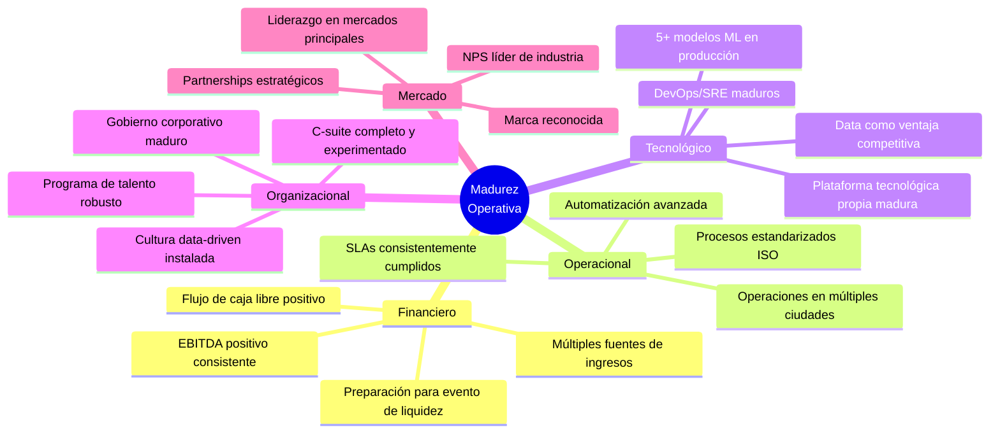
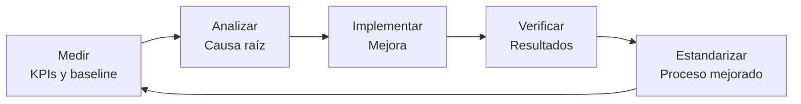
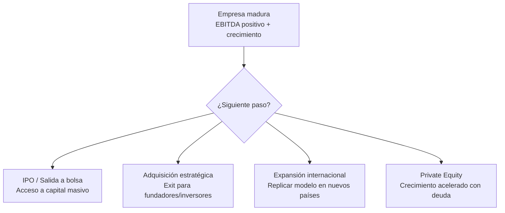

# Fase 3 — Madurez Operativa

**Etapa:** 48+ meses  
**Objetivo:** Optimizar la eficiencia, fortalecer el gobierno corporativo, expandir el modelo y preparar la siguiente fase de valor (IPO, adquisición o expansión internacional).

---

## 1. Características de la Fase de Madurez



---

## 2. Optimización Continua

### Framework de mejora continua — Kaizen empresarial



### Áreas de optimización prioritarias

| Área | Técnica de optimización | Meta de mejora |
|---|---|---|
| Rutas operativas | Algoritmo de optimización ML | -12% costo de combustible |
| Asignación de vehículos | Predicción de demanda por zona/hora | +18% utilización de flota |
| Precios dinámicos | Revenue management algoritmo | +10% revenue por viaje |
| Atención al cliente | NLP + chatbot IA | -40% costos de contact center |
| Mantenimiento | Mantenimiento predictivo IoT | -25% tiempo fuera de servicio |
| Detección de fraude | Ensemble ML | -95% pérdidas por fraude |

---

## 3. Eficiencia Operativa

### Indicadores de eficiencia objetivo — Madurez

| KPI | Fase Crecimiento | Fase Madurez | Industria benchmark |
|---|---|---|---|
| Revenue per employee | $70K/año | $120K/año | $100K/año |
| Costo operativo / ingreso % | 53% | 42% | 48% |
| Utilización de flota % | 65% | 82% | 75% |
| Viajes por vehículo/día | 18 | 28 | 22 |
| Automatización de procesos % | 40% | 75% | 55% |
| Tiempo promedio de respuesta a cliente | 3.5h | 1.2h | 2.5h |

---

## 4. Automatización Avanzada

### Mapa de automatización — Fase Madurez

```
NIVEL 1 — Automatización básica (ya logrado en F2)
├── Reportes automáticos
├── Facturación automática
├── Onboarding automatizado
└── Alertas de KPIs

NIVEL 2 — Automatización inteligente (objetivo F3)
├── Decisiones de pricing en tiempo real (ML)
├── Optimización de rutas dinámica (IA)
├── Predicción de demanda por zona (ML)
├── Mantenimiento predictivo (IoT + ML)
└── Detección de anomalías automática

NIVEL 3 — Automatización cognitiva (horizonte F3 avanzado)
├── Asistente IA para conductores
├── Atención al cliente 80% IA
├── Generación de reportes ejecutivos por IA
└── Agente de optimización presupuestaria
```

---

## 5. Gobierno Corporativo Maduro

### Estructura de gobierno

| Órgano | Composición | Frecuencia | Función |
|---|---|---|---|
| Directorio | 5-7 miembros (mayoría independiente) | Trimestral | Supervisión estratégica |
| Comité de Auditoría | 3 directores independientes | Mensual | Control y cumplimiento |
| Comité de Riesgos | CRO + 2 directores | Mensual | Gestión de riesgos |
| Comité de Compensaciones | CHRO + 2 directores | Trimestral | Estructuras salariales |
| Comité de Tecnología | CTO + CDO + 1 director | Mensual | Supervisión tech |

### Certificaciones objetivo

- [ ] ISO 9001:2015 (Calidad)
- [ ] ISO 27001:2022 (Seguridad de la información)
- [ ] ISO 14001:2015 (Gestión ambiental — sostenibilidad)
- [ ] CMMI Level 3 (Madurez de procesos de desarrollo)
- [ ] SOC 2 Type II (si hay clientes enterprise en USA)

---

## 6. P&L Objetivo — Fase Madurez

| Línea | Año 4 | Año 5 | Año 6 |
|---|---|---|---|
| **Ingresos** | $12M | $15M | $20M |
| Costo de servicio | ($6.5M) | ($7.8M) | ($10M) |
| **Margen bruto** | **$5.5M (46%)** | **$7.2M (48%)** | **$10M (50%)** |
| Marketing y ventas | ($1.8M) | ($2.1M) | ($2.8M) |
| Tecnología y ops | ($1.3M) | ($1.5M) | ($1.9M) |
| G&A | ($0.9M) | ($1.0M) | ($1.2M) |
| **EBITDA** | **$1.5M (12.5%)** | **$2.6M (17%)** | **$4.1M (20.5%)** |

---

## 7. Preparación para Evento de Liquidez

### Opciones estratégicas



### KPIs que se valoran para IPO/M&A

| Métrica | Requisito mínimo | Objetivo |
|---|---|---|
| Revenue growth YoY | > 30% | > 50% |
| EBITDA margin | > 15% | > 20% |
| NRR (Net Revenue Retention) | > 110% | > 120% |
| CAC Payback | < 12 meses | < 6 meses |
| Churn anual | < 15% | < 10% |
| Diversificación de ingresos | > 3 fuentes | > 5 fuentes |

---

## 8. KPIs de la Fase de Madurez

| KPI | Inicio F3 | Meta F3 (Año 6) |
|---|---|---|
| MAU | 500,000 | 1,500,000 |
| Ciudades | 4 | 12 |
| Ingresos | $12M | $20M |
| EBITDA margin | 12% | 20% |
| NPS | 70 | 78 |
| Churn mensual | 2.5% | 1.5% |
| Empleados | 200 | 450 |
| Modelos ML activos | 5 | 15 |
| Automatización procesos | 50% | 80% |
