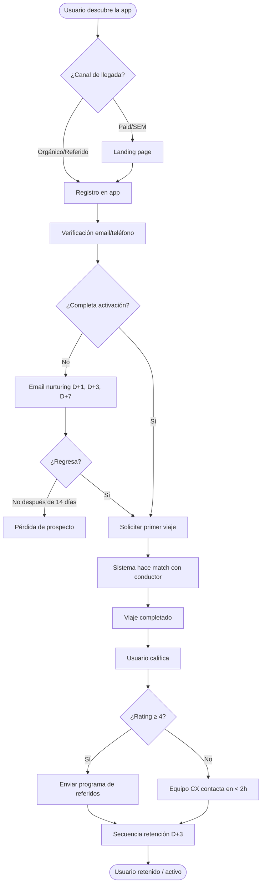
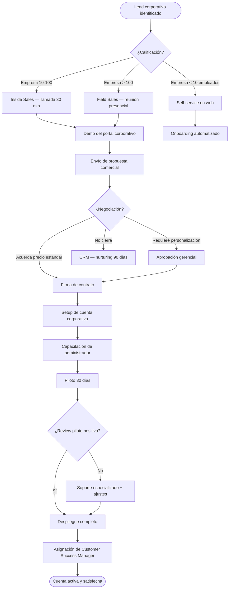
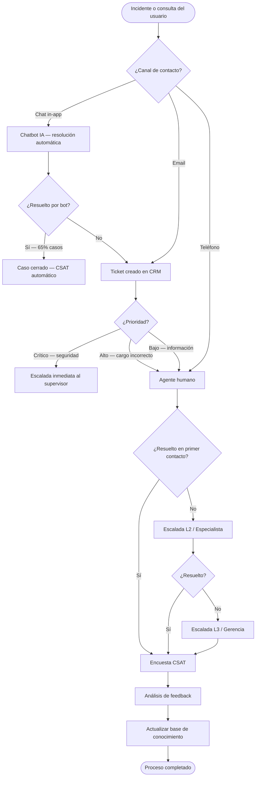

# Proceso de Ventas — BPMN

**Proceso:** Ciclo completo de ventas B2C y B2B  
**Versión:** 1.0  
**Propietario:** CMO / CCO  
**Última actualización:** 2026-06-02

---

## Proceso B2C — Adquisición y Primer Viaje



---

## Proceso B2B — Venta Corporativa



---

## Proceso de Atención al Cliente



---

## KPIs del Proceso de Ventas

| KPI | Meta | Fórmula |
|---|---|---|
| Tasa de conversión Lead → Cliente | ≥ 25% | (Clientes nuevos / Leads) × 100 |
| Tiempo promedio de cierre B2B | ≤ 21 días | Fecha cierre - Fecha primer contacto |
| Costo de adquisición (CAC) | ≤ $8 USD | Gasto marketing+ventas / Clientes nuevos |
| Activación (primer viaje en 7 días) | ≥ 70% | (Usuarios con 1+ viaje en 7d / Registros) × 100 |
| First Contact Resolution | ≥ 80% | (Casos resueltos en 1er contacto / Total) × 100 |
| SLA respuesta CS | ≤ 4 horas | Tiempo promedio primera respuesta |

---

## Métricas del Embudo de Ventas

```
100 visitantes al sitio
    ↓ CVR 20%
 20 registros
    ↓ Activación 70%
 14 usuarios activos
    ↓ Retención 30d 55%
  8 usuarios retenidos
    ↓ LTV $140
$1,120 ingreso esperado por cohorte de 100 visitantes
```

**CPA efectivo:** $8/100 visitantes × ($1,120 LTV) = ROI 14x por visitante convertido
