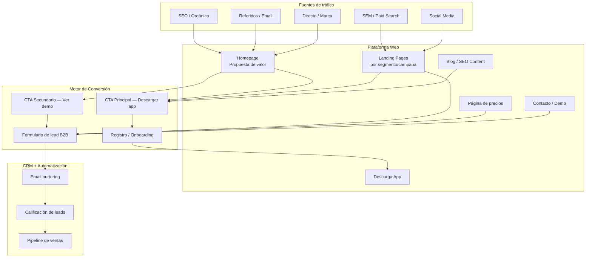

# Arquitectura Web y Estrategia Digital

**Versión:** 1.0  
**Fecha:** 2026-06-02  
**Propietario:** CMO + CTO

---

## 1. Arquitectura de la Presencia Digital



---

## 2. Estructura de Páginas — Mapa del Sitio

```
/ (Homepage)
├── /producto
│   ├── /para-usuarios
│   ├── /para-empresas
│   └── /para-conductores
├── /precios
│   ├── /plan-individual
│   └── /plan-corporativo
├── /como-funciona
├── /ciudad/[nombre-ciudad]      ← SEO local
├── /blog
│   ├── /categoria/[categoria]
│   └── /articulo/[slug]
├── /casos-de-exito
├── /contacto
├── /demo
├── /descargar-app
├── /conductores             ← landing para adquisición de conductores
└── /empresa
    ├── /sobre-nosotros
    ├── /equipo
    ├── /prensa
    └── /trabaja-con-nosotros
```

---

## 3. Funnel Digital — Etapas y Objetivos

```
TOFU — Top of Funnel (Awareness)
│  Objetivo: Alcanzar al mercado objetivo
│  Canales: SEO, Social, Display, PR
│  KPI: Visitantes únicos, Impresiones, Alcance
│  Contenido: Blog educativo, Videos how-to, Guías
│
├── CVR esperado: 15-20% de visitors a consideración
│
MOFU — Middle of Funnel (Consideration)
│  Objetivo: Generar interés activo y captar datos
│  Canales: SEM, Retargeting, Email, Contenido gated
│  KPI: Leads, CTR, Tiempo en sitio, Páginas/sesión
│  Contenido: Casos de éxito, Demos, Comparativas
│
├── CVR esperado: 25-35% de leads a activación
│
BOFU — Bottom of Funnel (Conversion)
│  Objetivo: Convertir lead en usuario/cliente activo
│  Canales: Email personalizado, SDR outbound, Retargeting
│  KPI: Activaciones, CAC, Tiempo de conversión
│  Contenido: Trial gratuito, Descuento primer viaje, ROI calculator
│
└── POST-CONVERSION (Retention & Advocacy)
   Objetivo: Retener y convertir en promotor
   Canales: Push notifications, Email, In-app
   KPI: Retención, NPS, Referidos generados
```

---

## 4. Landing Pages — Estructura Óptima

### Anatomía de una landing page de alta conversión

```
┌─────────────────────────────────────────┐
│  HERO SECTION                           │
│  • Headline con propuesta de valor      │
│  • Subheadline con beneficio principal  │
│  • CTA prominente (#1)                  │
│  • Visual (app screenshot / video)      │
├─────────────────────────────────────────┤
│  SOCIAL PROOF (trust signals)           │
│  • Logos de empresas clientes           │
│  • "500,000+ usuarios en 3 ciudades"    │
│  • Rating app store (4.6/5)             │
├─────────────────────────────────────────┤
│  BENEFICIOS CLAVE (3-4 items)           │
│  • Problema → Solución por cada uno     │
├─────────────────────────────────────────┤
│  CÓMO FUNCIONA (3 pasos)                │
│  • Paso 1, Paso 2, Paso 3               │
│  • Visual / GIF animado                 │
├─────────────────────────────────────────┤
│  TESTIMONIOS + CASOS DE ÉXITO           │
│  • 2-3 testimonios reales con foto      │
├─────────────────────────────────────────┤
│  FAQ (4-6 preguntas clave)              │
│  • Objeciones más comunes respondidas   │
├─────────────────────────────────────────┤
│  CTA FINAL (#2)                         │
│  • Repetir CTA principal                │
│  • Urgencia / escasez si aplica         │
└─────────────────────────────────────────┘
```

---

## 5. Core Web Vitals — Objetivos de Performance

| Métrica | Descripción | Objetivo | Herramienta de medición |
|---|---|---|---|
| **LCP** (Largest Contentful Paint) | Velocidad de carga percibida | ≤ 2.5s | PageSpeed Insights |
| **FID** (First Input Delay) | Interactividad | ≤ 100ms | Chrome UX Report |
| **CLS** (Cumulative Layout Shift) | Estabilidad visual | ≤ 0.1 | PageSpeed Insights |
| **TTFB** (Time to First Byte) | Respuesta del servidor | ≤ 600ms | WebPageTest |
| **Mobile Score** | Rendimiento en móvil | ≥ 90/100 | PageSpeed Insights |

---

## 6. SEO — Estrategia de Contenidos

### Clusters de contenido

```
CLUSTER PRINCIPAL: "Transporte urbano inteligente"
├── Página pilar: /transporte-urbano-inteligente
├── /ventajas-del-transporte-por-app
├── /como-elegir-servicio-de-transporte
├── /transporte-urbano-en-[ciudad]
└── /comparativa-opciones-transporte

CLUSTER B2B: "Movilidad corporativa"
├── Página pilar: /movilidad-corporativa
├── /beneficios-transporte-corporativo
├── /reducir-costos-transporte-empresa
└── /programa-movilidad-empleados
```

### KPIs de SEO

| KPI | Mes 3 | Mes 6 | Mes 12 |
|---|---|---|---|
| Posiciones en top 10 (keywords objetivo) | 15 | 40 | 80 |
| Tráfico orgánico mensual | 5,000 | 15,000 | 35,000 |
| Domain Authority | 20 | 30 | 45 |
| Backlinks de calidad (DA>40) | 10 | 30 | 80 |
