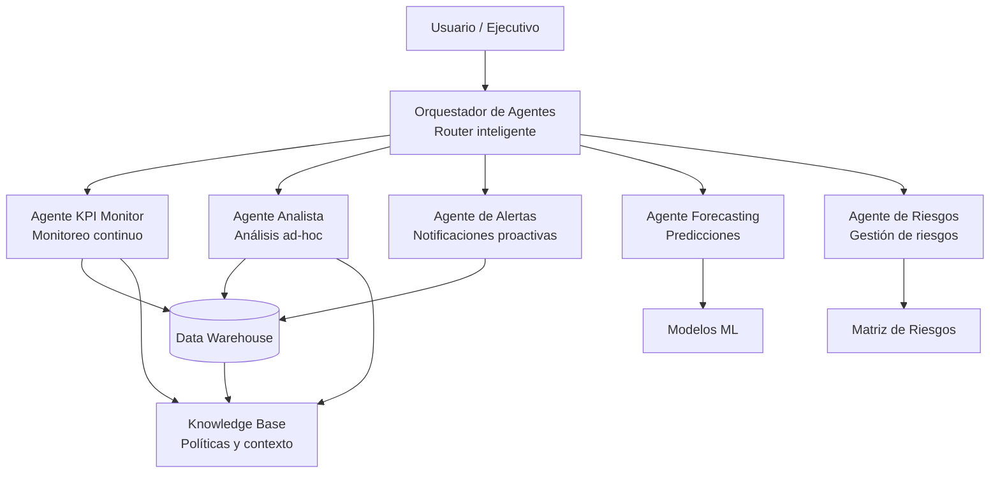
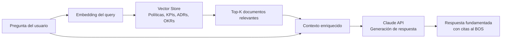

# Diseño de Agentes de IA Empresarial

**Versión:** 1.0  
**Fecha:** 2026-06-02  
**Propietario:** CDO + CTO

---

## Arquitectura General de Agentes



---

## Agente 1 — KPI Monitor

### Descripción

Monitorea continuamente los KPIs del negocio y genera alertas cuando se detectan desviaciones fuera de los umbrales configurados.

### Herramientas disponibles

```python
tools = [
    {
        "name": "get_kpi_snapshot",
        "description": "Obtiene el valor actual de uno o todos los KPIs",
        "parameters": {
            "kpi_names": "list[str] | 'all'",
            "period": "str — 'today' | 'this_week' | 'this_month'"
        }
    },
    {
        "name": "compare_kpi_vs_target",
        "description": "Compara KPIs actuales vs metas y retorna desviaciones",
        "parameters": {
            "kpi_name": "str",
            "period": "str"
        }
    },
    {
        "name": "send_alert",
        "description": "Envía alerta al responsable del KPI vía email/Slack",
        "parameters": {
            "kpi_name": "str",
            "semaforo": "str — 'ROJO' | 'AMARILLO'",
            "mensaje": "str",
            "destinatarios": "list[str]"
        }
    },
    {
        "name": "generate_kpi_report",
        "description": "Genera reporte HTML/PDF de KPIs para el período",
        "parameters": {
            "period": "str",
            "format": "str — 'html' | 'pdf' | 'slack_message'"
        }
    }
]
```

### Flujo de ejecución

```
CADA DÍA A LAS 08:00 AM:
  1. get_kpi_snapshot(period="this_month")
  2. Para cada KPI:
     a. compare_kpi_vs_target()
     b. Si semáforo = ROJO → send_alert(priority="HIGH")
     c. Si semáforo = AMARILLO → send_alert(priority="MEDIUM")
  3. generate_kpi_report(format="slack_message") → canal #kpi-diario
  4. Si hay 2+ KPIs en ROJO → escalar a CEO
```

---

## Agente 2 — Analista de Datos

### Descripción

Responde preguntas en lenguaje natural sobre el estado del negocio, accede al Data Warehouse y genera análisis on-demand.

### Capacidades

```
CONSULTAS SOPORTADAS:
• "¿Cuál fue el revenue de esta semana vs la semana pasada?"
• "Muéstrame el top 5 de zonas con mayor demanda ayer"
• "¿Cuántos usuarios activos nuevos tuvimos en mayo?"
• "¿Cuál es la tendencia del NPS en los últimos 6 meses?"
• "Compara el CAC por canal de adquisición este trimestre"

HERRAMIENTAS:
• query_warehouse(sql: str) → DataFrame
• plot_chart(data: dict, chart_type: str) → imagen
• summarize_data(data: dict, context: str) → texto ejecutivo
• export_to_excel(data: dict) → archivo
```

### Ejemplo de interacción

```
USUARIO: "¿Por qué cayó el NPS este mes?"

AGENTE:
  1. query_warehouse("SELECT AVG(rating), COUNT(*), zona, motivo_insatisfaccion 
     FROM trips WHERE fecha >= '2026-05-01' AND rating <= 3 
     GROUP BY zona, motivo_insatisfaccion ORDER BY COUNT(*) DESC")
  
  2. Analiza los resultados y genera:
  
  "El NPS cayó de 67 a 61 este mes. Análisis de causa raíz:
   
   • 58% de los ratings bajos vienen de la zona Centro (tiempo de espera > 15 min)
   • 23% reportan problemas con la app (crashes en versión 3.2.1)
   • 19% restante: precio percibido como alto en viajes cortos
   
   ACCIONES RECOMENDADAS:
   1. COO: aumentar disponibilidad de conductores en Centro horario pico
   2. CTO: deploy del hotfix para la app — urgente, 47% de detractores lo mencionan
   3. CMO: revisión de comunicación de valor en viajes cortos"
```

---

## Agente 3 — Gestor de Riesgos

### Descripción

Monitorea continuamente los indicadores de riesgo, evalúa nuevas amenazas y actualiza la matriz de riesgos.

### Herramientas

```python
tools = [
    "get_risk_matrix() → dict",           # Lee matriz_riesgos.json
    "evaluate_kri(kri_name) → dict",      # Evalúa indicador de riesgo
    "update_risk_status(risk_id, status)", # Actualiza estado de riesgo
    "create_incident(details) → str",     # Registra nuevo incidente
    "get_controls_status() → list",       # Lee estado de controles
    "generate_risk_report(period) → str", # Genera reporte de riesgos
]
```

---

## Agente 4 — Forecasting

### Descripción

Ejecuta y actualiza los modelos predictivos de ingresos y demanda. Responde preguntas sobre proyecciones futuras.

### Capacidades

```
• "¿Cuál es el forecast de revenue para Q3?"
• "Si el CAC sube 20%, ¿cuánto impacta el EBITDA del año?"
• "¿Cuántos conductores necesitaremos en diciembre según la demanda?"
• "Actualiza el forecast con los datos reales de mayo"
```

---

## Arquitectura RAG (Retrieval-Augmented Generation)



### Documentos en la Knowledge Base

| Categoría | Documentos | Propósito |
|---|---|---|
| Estrategia | modelo_negocio.md, mapa_estrategico.md | Contexto estratégico |
| KPIs | diccionario_kpi.json | Definiciones y fórmulas |
| Riesgos | matriz_riesgos.json, controles.json | Estado de riesgos |
| OKRs | objetivos_estrategicos.json | Metas vigentes |
| Políticas | Todas las políticas | Cumplimiento |
| Procesos | procesos_bpmn | Flujos operativos |

---

## Stack Tecnológico para Agentes

```yaml
Orquestación:
  - Framework: LangGraph / CrewAI
  - LLM: Claude claude-sonnet-4-6 (via Anthropic API)
  - Embeddings: text-embedding-3-small (OpenAI) o voyage-large-2

Vector Store:
  - Producción: Pinecone / Weaviate
  - Desarrollo: ChromaDB (local)

Herramientas:
  - Database: PostgreSQL + SQLAlchemy
  - Cache: Redis (respuestas frecuentes)
  - Notificaciones: Slack API + Email SMTP

Observabilidad de Agentes:
  - Langfuse (trazabilidad de prompts y respuestas)
  - Prometheus + Grafana (métricas de latencia)
```
