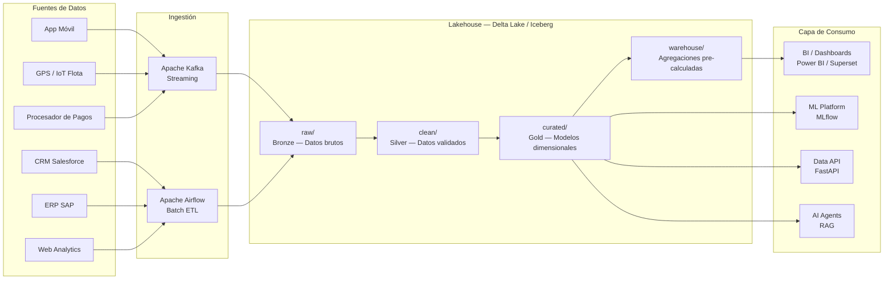

# Catálogo de Datos — Data Platform

**Versión:** 1.0  
**Fecha:** 2026-06-02  
**Propietario:** CDO / Data Governance Team

---

## Arquitectura de la Plataforma de Datos



---

## Dominios de Datos

### Dominio 1: Usuarios y Clientes

| Dataset | Capa | Descripción | Frecuencia de actualización | Owner |
|---|---|---|---|---|
| `raw.users_raw` | Bronze | Registros de usuarios tal como llegan del backend | Tiempo real | Data Engineering |
| `clean.users_clean` | Silver | Usuarios validados, sin duplicados, con PII enmascarada | 15 min | Data Engineering |
| `curated.dim_users` | Gold | Dimensión de usuarios para DW (slowly changing) | Horaria | Data Analytics |
| `curated.user_segments` | Gold | Segmentación ML de usuarios por comportamiento | Diaria | Data Science |

### Dominio 2: Viajes y Transacciones

| Dataset | Capa | Descripción | Frecuencia de actualización | Owner |
|---|---|---|---|---|
| `raw.trips_raw` | Bronze | Eventos de viaje del sistema operativo | Tiempo real | Data Engineering |
| `clean.trips_clean` | Silver | Viajes validados, con geolocalización normalizada | Tiempo real | Data Engineering |
| `curated.fact_trips` | Gold | Tabla de hechos de viajes (modelo estrella) | Streaming | Data Analytics |
| `warehouse.trips_daily_agg` | Aggregated | Agregaciones diarias por zona, hora, conductor | Diaria 2am | Data Engineering |

### Dominio 3: Conductores y Flota

| Dataset | Capa | Descripción | Frecuencia de actualización | Owner |
|---|---|---|---|---|
| `raw.drivers_raw` | Bronze | Datos de conductores y vehículos | Batch diario | Data Engineering |
| `clean.fleet_clean` | Silver | Flota normalizada con estado y ubicación | 5 min | Data Engineering |
| `curated.dim_drivers` | Gold | Dimensión de conductores para DW | Horaria | Data Analytics |
| `curated.fleet_telemetry` | Gold | Telemetría IoT procesada y limpia | Tiempo real | Data Science |

### Dominio 4: Financiero

| Dataset | Capa | Descripción | Frecuencia de actualización | Owner |
|---|---|---|---|---|
| `raw.payments_raw` | Bronze | Transacciones del procesador de pagos | Tiempo real | Data Engineering |
| `clean.revenue_clean` | Silver | Revenue reconocido y reconciliado | Diaria | Data Engineering |
| `curated.fact_revenue` | Gold | Tabla de hechos de ingresos | Diaria 3am | Data Analytics |
| `warehouse.finance_kpis` | Aggregated | KPIs financieros pre-calculados | Diaria 4am | Data Analytics |

### Dominio 5: Marketing y Adquisición

| Dataset | Capa | Descripción | Frecuencia de actualización | Owner |
|---|---|---|---|---|
| `raw.web_events_raw` | Bronze | Eventos de Google Analytics / Mixpanel | Diaria | Data Engineering |
| `clean.leads_clean` | Silver | Leads normalizados del CRM | Horaria | Data Engineering |
| `curated.marketing_funnel` | Gold | Métricas del funnel de adquisición | Diaria | Data Analytics |
| `warehouse.cac_by_channel` | Aggregated | CAC por canal de adquisición | Semanal | Data Analytics |

---

## Flujo de Datos — De Evento a Decisión

```
[Evento de negocio: viaje completado]
    ↓ Kafka (< 1 seg)
raw.trips_raw
    ↓ Spark Streaming (< 5 min)
clean.trips_clean
    ↓ dbt incremental (horario)
curated.fact_trips + curated.dim_users
    ↓ dbt aggregation (diaria 2am)
warehouse.kpis_daily
    ↓ BI / Dashboard (refresh automático)
[KPI visible en tablero ejecutivo]
    ↓ Alertas automáticas si umbral superado
[Notificación al responsable]
    ↓ AI Agent analiza contexto
[Recomendación accionable al ejecutivo]
    ↓ Decisión de negocio documentada en ADR
[Trazabilidad completa en Git]
```

---

## SLAs de Datos

| Dataset | SLA de disponibilidad | Latencia máxima | RPO |
|---|---|---|---|
| fact_trips | 99.9% | 5 minutos | 1 minuto |
| finance_kpis | 99.5% | 6 horas | 1 hora |
| marketing_funnel | 99% | 24 horas | 4 horas |
| dim_users | 99.9% | 1 hora | 15 minutos |
| fleet_telemetry | 99.5% | 30 segundos | 30 segundos |
