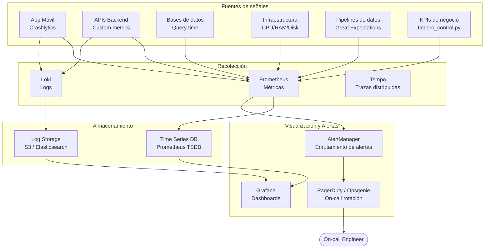

# Sistema de Observabilidad Empresarial

**Versión:** 1.0  
**Fecha:** 2026-06-02  
**Propietario:** CTO + CDO

---

## Arquitectura de Observabilidad



---

## Niveles de Observabilidad

### Nivel 1 — Infraestructura

| Métrica | Umbral alerta WARNING | Umbral alerta CRITICAL | Herramienta |
|---|---|---|---|
| CPU utilización | > 70% por 5 min | > 90% por 2 min | Prometheus + Node Exporter |
| RAM utilización | > 80% | > 95% | Prometheus + Node Exporter |
| Disk I/O | > 80% capacidad | > 95% | Prometheus + Node Exporter |
| Network latency | > 100ms p99 | > 500ms p99 | Prometheus |
| Pod restarts (K8s) | > 3 en 1 hora | > 10 en 1 hora | Kubernetes metrics |

### Nivel 2 — Aplicación

| Métrica | Umbral WARNING | Umbral CRITICAL | SLO |
|---|---|---|---|
| API p99 latency | > 500ms | > 2000ms | < 300ms |
| API error rate | > 1% | > 5% | < 0.5% |
| App crash rate | > 0.5% | > 2% | < 0.1% |
| DB query time p95 | > 200ms | > 1000ms | < 100ms |
| Cache hit rate | < 85% | < 70% | > 90% |

### Nivel 3 — Negocio (Business KPIs)

| KPI | Umbral WARNING | Umbral CRITICAL |
|---|---|---|
| Viajes/hora (vs promedio histórico) | -20% | -40% |
| Tasa de éxito de pagos | < 96% | < 92% |
| Tiempo de match conductor-usuario | > 5 min | > 10 min |
| Conductores disponibles en hora pico | < 80% del necesario | < 60% |

### Nivel 4 — Calidad de Datos

| Check | Umbral WARNING | Umbral CRITICAL |
|---|---|---|
| Pipeline completitud | < 98% campos requeridos | < 95% |
| Datos en retraso vs SLA | > 2x tiempo normal | > 5x tiempo normal |
| Registros duplicados | > 0.5% | > 2% |
| Datos faltantes en KPI crítico | Cualquier KPI con valor NULL | KPI financiero NULL |

---

## Runbooks de Respuesta a Alertas

### CRIT-001: Plataforma no disponible

```
TRIGGER: Uptime < 99% en los últimos 5 minutos
SEVERIDAD: P1 — Critical
ON-CALL: CTO + Lead DevOps

PASOS DE RESPUESTA:
1. Verificar health check de todos los servicios (30 seg)
   → kubectl get pods -A | grep -v Running
2. Revisar últimos deploys en los últimos 60 minutos
   → kubectl rollout history deployment/api-gateway
3. Si hay deploy reciente → rollback inmediato
   → kubectl rollout undo deployment/api-gateway
4. Si no hay deploy → verificar recursos cloud (AWS Console)
5. Activar modo de mantenimiento si ETA > 30 min
6. Comunicar a stakeholders en canal #incidents
7. Crear ticket post-mortem al resolver

SLA DE RESPUESTA: 15 minutos desde alerta hasta acción
SLA DE RESOLUCIÓN: 2 horas
```

### WARN-002: Alto tiempo de espera usuarios

```
TRIGGER: Tiempo promedio de match > 8 minutos en los últimos 30 min
SEVERIDAD: P2 — High
ON-CALL: COO + CTO

PASOS DE RESPUESTA:
1. Verificar disponibilidad de conductores por zona en dashboard
2. Activar incentivos de surge pricing si corresponde
3. Contactar coordinadores de flota para redistribución
4. Si > 15 min → activar conductores de lista de espera

SLA DE RESPUESTA: 30 minutos
```

---

## SLOs (Service Level Objectives)

```yaml
slos:
  - nombre: "Disponibilidad de Plataforma"
    objetivo: "99.9% de uptime mensual"
    medicion: "Porcentaje de minutos sin errores 5xx"
    ventana: "Rolling 30 días"
    error_budget: "43.8 minutos de downtime permitidos/mes"

  - nombre: "Latencia de API"
    objetivo: "95% de requests bajo 300ms"
    medicion: "p95 latency de endpoints críticos"
    ventana: "Rolling 7 días"

  - nombre: "Éxito de Pagos"
    objetivo: "99.5% de transacciones exitosas"
    medicion: "% transacciones completadas / intentadas"
    ventana: "Rolling 24 horas"

  - nombre: "Pipeline de Datos"
    objetivo: "95% de pipelines completados en SLA"
    medicion: "% pipelines sin falla en tiempo definido"
    ventana: "Diario"
```

---

## Dashboard de Observabilidad — Paneles

### Panel Ejecutivo (actualización cada 5 min)

```
┌────────────────────────────────────────────────────────────────┐
│  🟢 PLATAFORMA OPERATIVA   Uptime: 99.94%   │  12:45 UTC-5    │
├────────────────────────────────────────────────────────────────┤
│  Viajes/hora: 1,247   │   Pago OK: 99.7%   │  Match: 3.2 min  │
│  API p99: 245ms       │  Error rate: 0.3%  │  Conduct. activos: 342 │
├────────────────────────────────────────────────────────────────┤
│  ALERTAS ACTIVAS: 0 críticas, 1 warning (CPU 71% nodo-03)     │
└────────────────────────────────────────────────────────────────┘
```
